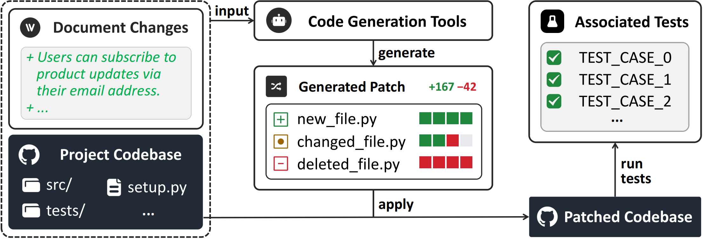
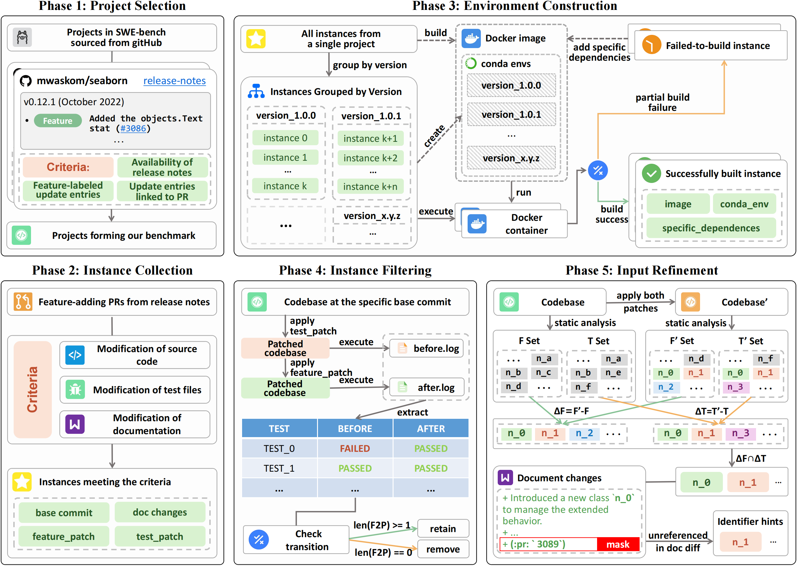

# NoCode-bench

**NoCode-bench** is a benchmark designed to evaluate the ability of Large Language Models (LLMs) to perform **no-code feature addition** using natural language documentation as input. Unlike prior benchmarks that focus on bug fixing or general issue resolution, NoCode-bench targets a new paradigm where feature development is driven by documentation changes in real-world software projects.

## 📦 Benchmark Overview



- **Instances**: 634 real-world feature addition tasks across diverse GitHub projects
- **Format**: Each instance contains the documentation change, relevant context files, and a ground truth patch
- **Subset**: Includes a manually verified subset (**NoCode-bench-Verified**) for high-quality, human-evaluated evaluation

> [!NOTE]
> We will provide the benchmark's Docker images and upload the benchmark to open-source platforms like huggingface after the paper can be de-anonymized.

## 🚀 How to Use the Benchmark

### 1. Environment Setup

NoCode-bench enables reproducible evaluations via Docker, by building the base image (`fb_base:dev`) and the project image (`fb_[repo]:dev`) as follows:

```bash
cd environment
bash setup_all.sh
```

### 2. Data Loading

The benchmark data is stored in `data/instances/`:

```sh
results/
  augmentation/
    ├── ncb-verified_v0.1_augmented_masked.jsonl # FULL
    └── ncb-verified_v0.1_augmented_masked.jsonl # VERUFIED
```

Each instance in `NoCode-bench-Verified` has been manually annotated to ensure **task clarity** and **evaluation accuracy**.

### 3. Patch Generation

First, load the data：

```python
bench_fpath = 'results/augmentation/fb-verified_v0.1_masked_augmented.jsonl'
instances = load_jsonl(bench_fpath)
```

For evaluation, you only need to focus on the following information

Given an instance:

- instance['instance_id']: unique identifier of the instance
- instance['mask_doc_changes']: main input for the task
- instance['augmentations']: optional input, which annotates newly introduced but undocumented entities to help mitigate FalseNegative caused by naming issues

Then, you need to generate the prediction results that meet the following format for easy evaluation

```python
# Output Format
instances = [
  {
    'instance_id': '...',
    'model_patch': '...',
  },
  ...
]
```

### Evaluation

```sh
export PYTHONPATH=$PYTHONPATH:$(pwd)
# modify the predictions_path parameter
sh evaluation/eval.sh --predictions_path preds.jsonl 
```

------

## 🔧 How to Reconstruct the Benchmark

You can reproduce or extend NoCode-bench using our 5-step construction pipeline:



### Step 1: Project Selection

- Select high-quality, actively maintained GitHub repositories

```sh
cd repos/
sh collect.sh
```

### Step 2: Instance Collection

- Parse release notes to identify real feature addition tasks
- Retrieve corresponding PR from GitHub

```python
python construction/collection/collect_[repo].py
python construction/filter_attribute/attribute_filter.py
```

### Step 3: Environment Construction

- All involved data and scripts are stored in the `environment/` folder
- Include related modules, configuration, and dependencies

### Step 4: Instance Filtering

- Automatically filter out instances that cannot meet our criteria

```python
python construction/filter_execution/execution.py
```

### Step 5: Input Refinement

- Supplement missing but essential entity names in the task input.
- Mask information that may cause data leakage

```python
python construction/augmentation/augment.py
python construction/augmentation/mask_auto.py
```

